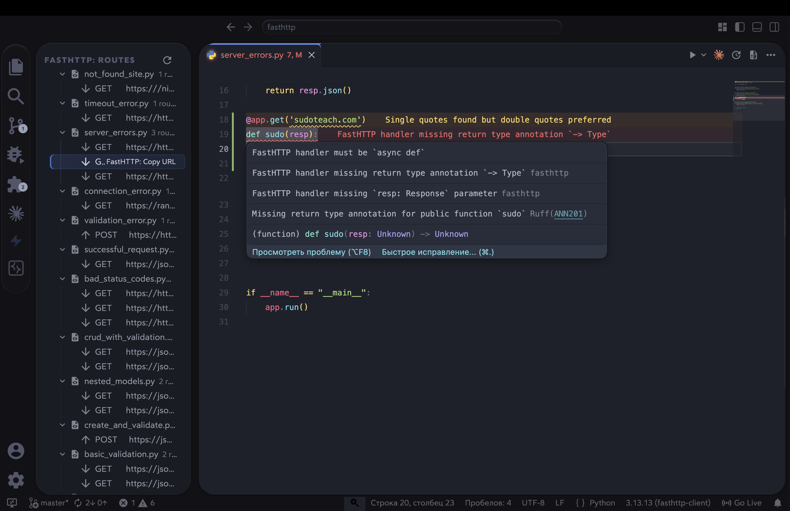

<p align="center">
  
</p>
<p align="center">
    <em>VS Code extension for FastHTTP — scaffold projects, explore routes, and catch errors directly in the editor.</em>
</p>
<p align="center">
<a href="https://marketplace.visualstudio.com/items?itemName=ndugram.fasthttp-extension" target="_blank">
    
</a>
<a href="https://marketplace.visualstudio.com/items?itemName=ndugram.fasthttp-extension" target="_blank">
    
</a>
<a href="https://github.com/ndugram/fasthttp-extension" target="_blank">
    
</a>
</p>

---

**FastHTTP**: <a href="https://github.com/ndugram/fasthttp" target="_blank">https://github.com/ndugram/fasthttp</a>

**Source Code**: <a href="https://github.com/ndugram/fasthttp-extension" target="_blank">https://github.com/ndugram/fasthttp-extension</a>

---

FastHTTP Extension brings the full **FastHTTP development experience** into VS Code — project scaffolding, route explorer, inline diagnostics, and CodeLens actions.



Key features:

- **Create Project** — scaffold a ready-to-run FastHTTP project from the Command Palette in seconds.
- **Route Explorer** — sidebar panel showing all `@app.get/post/...` routes across your workspace, grouped by file. Click any route to jump to its definition.
- **CodeLens** — `▶ Run` and `Copy URL` actions appear above every route decorator.
- **Diagnostics** — inline errors and warnings for missing `async def`, missing `-> ReturnType`, and missing `resp: Response` parameter.
- **Smart detection** — only activates on files that actually instantiate `FastHTTP()` or `Router()`. No false positives from FastAPI or other frameworks.

## Requirements

- VS Code `^1.85.0`
- <a href="https://github.com/ndugram/fasthttp" target="_blank">fasthttp-client</a> installed in your Python environment to run generated projects.

## Installation

Install from the VS Code Marketplace:

1. Open VS Code
2. Press `Ctrl+P` (or `Cmd+P` on macOS)
3. Run `ext install ndugram.fasthttp-extension`

Or search **FastHTTP** in the Extensions panel.

## Usage

### Create a project

1. Open the Command Palette (`Ctrl+Shift+P` / `Cmd+Shift+P`)
2. Type `FastHTTP: Create Project`
3. Enter a project name
4. Select a folder where the project will be created
5. Choose to open the project in a new or current window

### Generated structure

```
my-project/
├── main.py
├── requirements.txt
└── pyproject.toml
```

#### `main.py`

```python
from fasthttp import FastHTTP
from fasthttp.response import Response

app = FastHTTP()


@app.get(url="https://httpbin.org/get")
async def get_data(resp: Response) -> dict:
    return resp.json()


if __name__ == "__main__":
    app.run()
```

### Route Explorer

Open the FastHTTP panel in the activity bar to see all routes in your workspace:

```
FASTHTTP ROUTES
└── main.py  3 routes
    ├── GET      https://httpbin.org/get        get_data()
    ├── POST     https://httpbin.org/post       post_data()
    └── DELETE   https://httpbin.org/delete     delete_data()
```

Click any route → jumps to the decorator in the file. Use the `⟳` button to refresh manually.

### Diagnostics

The extension highlights handler errors inline:

| Problem | Severity |
|---|---|
| `def` instead of `async def` | ⚠️ Warning |
| Missing `-> ReturnType` annotation | ❌ Error |
| Missing `resp: Response` parameter | ⚠️ Warning |

### Run the generated project

```console
$ pip install fasthttp-client
$ python3 main.py
```

You will see output like:

```
16:09:18.955 │ INFO │ fasthttp │ ✔ FastHTTP started
16:09:19.519 │ INFO │ fasthttp │ ✔ GET https://httpbin.org/get [200] 458.26ms
16:09:20.037 │ INFO │ fasthttp │ ✔ Done in 1.08s
```

## Contributing

Contributions are welcome! Please read [CONTRIBUTING.md](.github/CONTRIBUTING.md) before opening a pull request.

Found a security issue? See the <a href="https://github.com/ndugram/fasthttp-extension/blob/master/SECURITY.md" target="_blank">Security Policy</a>.

## License

This project is licensed under the terms of the <a href="https://github.com/ndugram/fasthttp-extension/blob/master/LICENSE" target="_blank">MIT license</a>.
